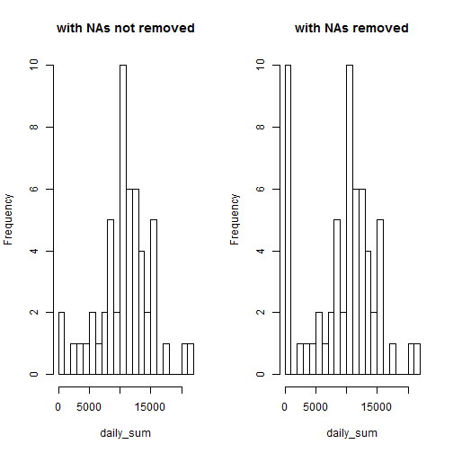
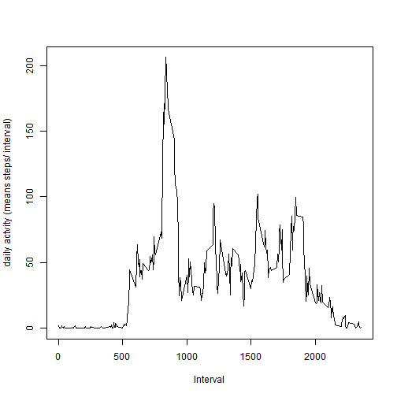
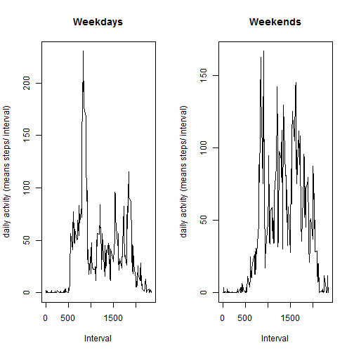

---
title: 'Reproducible Research: Peer Assessment 1'
output:
  word_document: default
  html_document:
    Author: Ramamurthi Sridharan
    keep_md: yes

Loading and preprocessing the data.


```r
##  Set the directory in which the activity.zip file exists as the working ##  directory in the RStudio.
##  Data can now be directly read and unzipped.
library(knitr)
library(markdown)

data <- read.csv(unzip("activity.zip","activity.csv"))
## do some exploratory analysis to understand the structure and content of data.
nrow(data)
```

```
## [1] 17568
```

```r
summary(data)
```

```
##      steps                date          interval     
##  Min.   :  0.00   2012-10-01:  288   Min.   :   0.0  
##  1st Qu.:  0.00   2012-10-02:  288   1st Qu.: 588.8  
##  Median :  0.00   2012-10-03:  288   Median :1177.5  
##  Mean   : 37.38   2012-10-04:  288   Mean   :1177.5  
##  3rd Qu.: 12.00   2012-10-05:  288   3rd Qu.:1766.2  
##  Max.   :806.00   2012-10-06:  288   Max.   :2355.0  
##  NA's   :2304     (Other)   :15840
```
summary of data indicate there are 2304 NA's in the data set.
There are three variables and 17568 records.

In the next step we compute the daily sum of total steps without and with removal of NA values and and plot the respective histograms side-by-side.

```r
##  Compute the daily sum of total steps without and with the removal of NAs. Plot the results side-by-side for comparison.
par(mfrow=c(1,2))
daily_sum <- tapply(data$steps, data$date, sum)
hist(daily_sum, breaks=20, main = "with NAs not removed")
daily_sum <- tapply(data$steps, data$date, sum, na.rm=T)
hist(daily_sum, breaks =20,main = "with NAs removed")
```

 
The Change in the frequency of "0" counts as sum points to the difference in the computations. Further to dermine the mean, we need to have the NAs removed

What is mean total number of steps taken per day?


```r
mean_total = mean(daily_sum)
round(mean_total)
```

```
## [1] 9354
```
The mean number of stpes per day is 9354.

What is the average daily activity pattern? Plot it as a time series.


```r
## mean per interval is computed with the removal of NAs.
daily.int.mean = NULL
daily.int.mean <- tapply(data$steps, data$interval, mean, na.rm = TRUE)
plot(daily.int.mean ~ data$interval[1:length(daily.int.mean)], type = "l", xlab = "Interval", ylab = "daily actvity (means steps/ interval)")
```

 
Determine the 5 minute interval containing the maximum number of steps


```r
round(max(daily.int.mean))
```

```
## [1] 206
```

```r
data$interval[match(max(daily.int.mean),daily.int.mean)]
```

```
## [1] 835
```
The interval is 835 and the maximum number of steps is 206.

Imputing missing values


```r
##  set the daily mean values for corresponding interval is used to  
##  replace  the NA's
data[is.na(data)] <- tapply(data$steps, data$interval, mean, na.rm = TRUE)
## test with summary call for removal of NAs.
summary(data)
```

```
##      steps                date          interval     
##  Min.   :  0.00   2012-10-01:  288   Min.   :   0.0  
##  1st Qu.:  0.00   2012-10-02:  288   1st Qu.: 588.8  
##  Median :  0.00   2012-10-03:  288   Median :1177.5  
##  Mean   : 37.38   2012-10-04:  288   Mean   :1177.5  
##  3rd Qu.: 27.00   2012-10-05:  288   3rd Qu.:1766.2  
##  Max.   :806.00   2012-10-06:  288   Max.   :2355.0  
##                   (Other)   :15840
```

```r
##  Determine the daily sum with the new set of data and plot.
daily_sum <- tapply(data$steps, data$date, sum)
hist(daily_sum, breaks=20, main = "NAs replaced with interval means")
```

 

```r
summary(data)
```

```
##      steps                date          interval     
##  Min.   :  0.00   2012-10-01:  288   Min.   :   0.0  
##  1st Qu.:  0.00   2012-10-02:  288   1st Qu.: 588.8  
##  Median :  0.00   2012-10-03:  288   Median :1177.5  
##  Mean   : 37.38   2012-10-04:  288   Mean   :1177.5  
##  3rd Qu.: 27.00   2012-10-05:  288   3rd Qu.:1766.2  
##  Max.   :806.00   2012-10-06:  288   Max.   :2355.0  
##                   (Other)   :15840
```
The mean of the sums is 37.38 and the median is 0.00. There is no difference in this value because Na values in the original data set have been replaced by the interval means, which will not affect the effective mean or median of the sum. 

Are there differences in activity patterns between weekdays and weekends?
Yes. See below.

```r
data["day"] <- NA
data$day <- weekdays(as.Date(data$date))
summary(data)
```

```
##      steps                date          interval          day           
##  Min.   :  0.00   2012-10-01:  288   Min.   :   0.0   Length:17568      
##  1st Qu.:  0.00   2012-10-02:  288   1st Qu.: 588.8   Class :character  
##  Median :  0.00   2012-10-03:  288   Median :1177.5   Mode  :character  
##  Mean   : 37.38   2012-10-04:  288   Mean   :1177.5                     
##  3rd Qu.: 27.00   2012-10-05:  288   3rd Qu.:1766.2                     
##  Max.   :806.00   2012-10-06:  288   Max.   :2355.0                     
##                   (Other)   :15840
```

```r
data.weekday <- subset(data, day == "Monday"|day =="Tuesday"| day=="Wednesday" |day =="Thursday" |day =="Friday")
data.weekend <- subset(data, day == "Sunday"|day =="Saturday")
data.wd = NULL
data.wd <- tapply(data.weekday$steps, data.weekday$interval, mean, na.rm = TRUE)
data.we = NULL
data.we<- tapply(data.weekend$steps, data.weekend$interval, mean, na.rm = TRUE)
par(mfrow = c(1,2))
plot(data.wd ~ data$interval[1:length(daily.int.mean)], main = "Weekdays", type = "l", xlab = "Interval", ylab = "daily actvity (means steps/ interval)")
plot(data.we ~ data$interval[1:length(daily.int.mean)], main = "Weekends", type = "l", xlab = "Interval", ylab = "daily actvity (means steps/ interval)")
```

 
